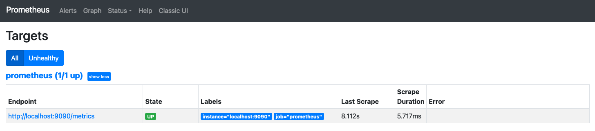

## Prometheus

### Running Prometheus

Created a file in `~/DockerContainers/Prometheus-Grafana/` called `startPrometheus.sh`

```shell
#!/bin/bash

docker run -p 9090:9090 prom/prometheus
```

### Adding Prometheus Actuator Support

I had to enable the prometheus endpoint as documented [here](https://docs.spring.io/spring-boot/docs/3.0.0-M4/reference/htmlsingle/#actuator.metrics.export.prometheus) and
[here](https://docs.spring.io/spring-boot/docs/3.0.0-M4/reference/htmlsingle/#actuator.endpoints.exposing).

```yaml
management:
  endpoints:
    web:
      exposure:
        include: "prometheus"
```

With this enabled I was able to hit the prometheus actuator endpoint.

``` shell
http :8080/actuator/prometheus
```

### Proof of Scraping

Visit [http://localhost:9090/targets](http://localhost:9090/targets) and you can see evidence of the scraping occurring.

